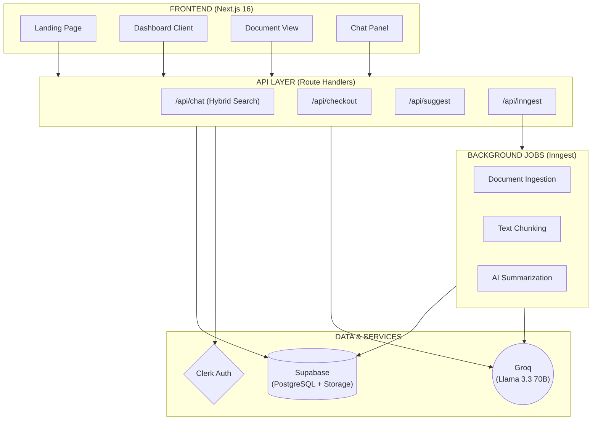
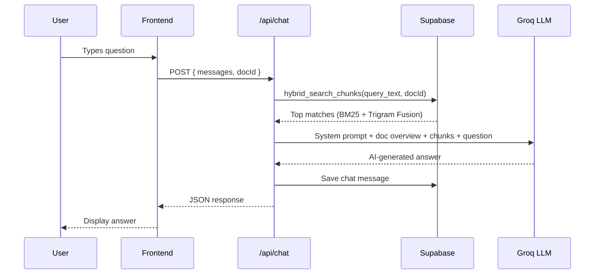

<div align="center">


<br/>
<br/>

# ✦ DocuMind

### AI-Powered Document Intelligence Platform

<p align="center">
  <strong>Upload. Analyze. Understand.</strong><br/>
  <sub>Transform your documents into actionable insights with cutting-edge AI</sub>
</p>

<br/>

[](https://docu-mind-phi-silk.vercel.app)
&nbsp;
[](https://github.com/your-username/docu-mind)

---

<p align="center">
  <em>A production-ready, multi-tenant SaaS built with Next.js 16, featuring hybrid RAG chat, real-time processing, and a gorgeous glassmorphic UI</em>
</p>

</div>

<br/>

## ⚡ What is DocuMind?

DocuMind is a **full-stack AI document intelligence platform** that lets users upload PDFs, Word documents, and PowerPoint files — then **chat with them** using sophisticated RAG (Retrieval-Augmented Generation). It intelligently chunks documents, indexes them using **hybrid search** (BM25 + Trigram), and retrieves precise context to generate grounded AI answers.

> **Not a toy project.** DocuMind is a fully deployed, multi-tenant SaaS with authentication, real-time updates, persistent chat history, project organization, storage management, Stripe billing, and a pixel-perfect responsive UI.

<br/>

## 🎯 Key Features

<table>
<tr>
<td width="50%">

### 📄 Multi-Format Upload
- **PDF**, **DOCX**, **PPTX** support (up to 5MB)
- Drag & drop with visual progress feedback
- Real-time status tracking (queued → processing → complete)
- Smart text extraction & chunking

</td>
<td width="50%">

### 🤖 RAG-Powered Chat
- Context-aware answers from your documents
- **Hybrid Search** (Keyword + Fuzzy Matching)
- Persistent chat history per document
- AI-suggested questions based on content

</td>
</tr>
<tr>
<td width="50%">

### 🏗️ Workspace Management
- **Projects** — Organize documents into folders
- **Star / Archive / Rename** — Full document lifecycle
- **Sort & Filter** — By date, name, size, type, pinned
- **Grid & List views** — Toggle between layouts

</td>
<td width="50%">

### 🎨 Premium UI/UX
- **Glassmorphic design** with backdrop blur effects
- **Dark & Light mode** with smooth transitions
- **Framer Motion** animations throughout
- **Fully responsive** — pixel-perfect on mobile

</td>
</tr>
<tr>
<td width="50%">

### ⚡ Real-Time Processing
- Supabase **Realtime** subscriptions for live updates
- Documents auto-refresh when processing completes
- Toast notifications for status changes
- Optimistic UI updates for instant feedback

</td>
<td width="50%">

### 🔐 Production-Ready
- **Clerk** authentication (OAuth, email, MFA)
- **Stripe** payment integration
- **Multi-tenant** data isolation per user
- **Storage quotas** with usage tracking

</td>
</tr>
</table>

<br/>

## 🏛️ Architecture



<br/>

## 🛠️ Tech Stack

| Layer | Technology | Purpose |
|-------|-----------|---------|
| **Framework** | Next.js 16 (App Router) | Full-stack React with RSC & Server Actions |
| **Language** | TypeScript | End-to-end type safety |
| **Styling** | Tailwind CSS 4 + CSS Animations | Responsive design + fluid animations |
| **UI Library** | shadcn/ui + Radix UI | Accessible, composable components |
| **Auth** | Clerk | OAuth, email auth, session management |
| **Database** | Supabase (PostgreSQL) | Documents, chunks, chat history, real-time |
| **Storage** | Supabase Storage | File uploads with per-user buckets |
| **AI / LLM** | Groq (Llama 3.3 70B) | Blazing-fast chat inference (free tier) |
| **Search** | Hybrid (BM25 + Trigram RRF) | Keyword + fuzzy matching via Supabase RPC |
| **Background Jobs** | Inngest | Durable document processing pipeline |
| **Payments** | Stripe | Subscription billing & webhooks |
| **File Parsing** | pdf-parse, Mammoth, JSZip | PDF, DOCX, PPTX (per-slide) extraction |
| **Deployment** | Vercel | Edge-optimized hosting |

<br/>

## 🚀 Getting Started

### Prerequisites

- **Node.js 18+** and npm
- [Supabase](https://supabase.com) project (free tier)
- [Clerk](https://clerk.com) application (free tier)
- [Groq](https://console.groq.com) API key (free tier)

### 1. Clone & Install

```bash
git clone https://github.com/your-username/DOCU_MIND.git
cd DOCU_MIND/docu-mind
npm install
```

### 2. Configure Environment

Create a `.env.local` file with the following variables:

```env
# Clerk Authentication
NEXT_PUBLIC_CLERK_PUBLISHABLE_KEY=pk_...
CLERK_SECRET_KEY=sk_...
NEXT_PUBLIC_CLERK_SIGN_IN_URL=/sign-in
NEXT_PUBLIC_CLERK_SIGN_UP_URL=/sign-up

# Supabase
NEXT_PUBLIC_SUPABASE_URL=https://your-project.supabase.co
NEXT_PUBLIC_SUPABASE_ANON_KEY=eyJ...
SUPABASE_SERVICE_ROLE_KEY=eyJ...

# AI
GROQ_API_KEY=gsk_...

# Stripe (optional)
STRIPE_SECRET_KEY=sk_...
NEXT_PUBLIC_STRIPE_PUBLISHABLE_KEY=pk_...
STRIPE_WEBHOOK_SECRET=whsec_...
```

### 3. Set Up Supabase

Run the SQL migrations in your Supabase SQL editor:

```sql
-- Enable Extensions
CREATE EXTENSION IF NOT EXISTS pg_trgm;

-- Documents table
CREATE TABLE documents (
  id UUID DEFAULT gen_random_uuid() PRIMARY KEY,
  user_id TEXT NOT NULL,
  file_name TEXT NOT NULL,
  file_type TEXT,
  file_size BIGINT NOT NULL DEFAULT 0,
  file_url TEXT,
  status TEXT NOT NULL DEFAULT 'queued',
  summary TEXT,
  is_starred BOOLEAN NOT NULL DEFAULT FALSE,
  is_archived BOOLEAN NOT NULL DEFAULT FALSE,
  project_id UUID REFERENCES projects(id),
  last_opened_at TIMESTAMPTZ,
  created_at TIMESTAMPTZ DEFAULT NOW(),
  updated_at TIMESTAMPTZ DEFAULT NOW(),
  page_count INTEGER
);

-- Document chunks for Search
CREATE TABLE document_chunks (
  id UUID DEFAULT gen_random_uuid() PRIMARY KEY,
  document_id UUID REFERENCES documents(id) ON DELETE CASCADE,
  user_id TEXT NOT NULL,
  content TEXT NOT NULL,
  page_number INTEGER,
  chunk_index INTEGER NOT NULL,
  created_at TIMESTAMPTZ DEFAULT NOW(),
  fts tsvector GENERATED ALWAYS AS (to_tsvector('english', coalesce(content, ''))) STORED
);

CREATE INDEX idx_chunks_fts ON document_chunks USING GIN (fts);
CREATE INDEX idx_chunks_trgm ON document_chunks USING GIN (content gin_trgm_ops);

-- Chat messages
CREATE TABLE chat_messages (
  id UUID DEFAULT gen_random_uuid() PRIMARY KEY,
  document_id UUID REFERENCES documents(id) ON DELETE CASCADE,
  user_id TEXT NOT NULL,
  role TEXT NOT NULL CHECK (role IN ('user', 'assistant')),
  content TEXT NOT NULL,
  created_at TIMESTAMPTZ DEFAULT NOW()
);

-- Projects
CREATE TABLE projects (
  id UUID DEFAULT gen_random_uuid() PRIMARY KEY,
  user_id TEXT NOT NULL,
  name TEXT NOT NULL,
  created_at TIMESTAMPTZ DEFAULT NOW()
);

-- Hybrid Search Function (BM25 + Trigram RRF)
CREATE OR REPLACE FUNCTION hybrid_search_chunks(
  query_text TEXT,
  target_doc_id UUID,
  target_user_id TEXT,
  match_count INT DEFAULT 10,
  bm25_weight FLOAT DEFAULT 1.0,
  trigram_weight FLOAT DEFAULT 0.5
) RETURNS TABLE (
  id UUID,
  content TEXT,
  chunk_index INT,
  page_number INT,
  bm25_score FLOAT,
  trigram_score FLOAT,
  combined_score FLOAT
) LANGUAGE plpgsql AS $$
-- Implementation details in supabase/phase5_hybrid_search.sql
$$;

-- Enable Realtime
ALTER PUBLICATION supabase_realtime ADD TABLE documents;
```

### 4. Run Development Server

```bash
npm run dev
```

Open [http://localhost:3000](http://localhost:3000) — you're ready to go! 🎉

<br/>

## 📁 Project Structure

```
docu-mind/
├── src/
│   ├── app/
│   │   ├── (auth)/              # Sign-in / Sign-up pages (Clerk)
│   │   ├── api/
│   │   │   ├── chat/            # RAG chat endpoint
│   │   │   ├── checkout/        # Stripe checkout session
│   │   │   ├── suggest/         # AI question suggestions
│   │   │   └── webhooks/        # Stripe webhook handler
│   │   ├── dashboard/
│   │   │   ├── document/[docId] # Document viewer + chat
│   │   │   ├── documents/       # All documents page
│   │   │   ├── chat-history/    # Chat history page
│   │   │   └── plans/           # Pricing plans
│   │   ├── page.tsx             # Landing page
│   │   ├── layout.tsx           # Root layout (Clerk + Theme)
│   │   └── globals.css          # Design system tokens
│   ├── components/
│   │   ├── chat/                # ChatPanel, ChatMessage
│   │   ├── ui/                  # shadcn/ui primitives
│   │   ├── DocumentCard.tsx     # Document grid/list card
│   │   ├── DocumentViewer.tsx   # PDF/file viewer
│   │   ├── DragDropZone.tsx     # Upload with drag & drop
│   │   ├── Header.tsx           # Top navigation bar
│   │   ├── Sidebar.tsx          # Collapsible sidebar
│   │   ├── SortFilterBar.tsx    # Sort & filter controls
│   │   ├── SettingsView.tsx     # User settings page
│   │   └── ThemeToggle.tsx      # Dark/light mode switch
│   ├── lib/
│   │   ├── actions/             # Server actions
│   │   │   ├── ingest.ts        # File parsing + chunking
│   │   │   ├── documents.ts     # CRUD operations
│   │   │   ├── chat.ts          # Chat history management
│   │   │   └── summarize.ts     # AI summarization
│   │   ├── supabase.ts          # Supabase admin client
│   │   ├── supabase-browser.ts  # Supabase browser client
│   │   └── utils/               # Helpers (fileTypes, time)
│   ├── hooks/                   # Custom React hooks
│   └── types/                   # TypeScript definitions
├── supabase/                    # Database migrations
├── public/                      # Static assets
└── package.json
```

<br/>

## 🔄 How Chat Works



<br/>

## 🎨 Design Philosophy

DocuMind follows a **premium glassmorphic design language** with these principles:

- **🌗 Dual Themes** — Full dark mode and light mode with seamless transitions
- **✨ CSS Animations** — Staggered entrance effects, glow pulses, and smooth transitions
- **📱 Mobile-First** — Tab-based layouts on mobile, split-pane on desktop, touch-optimized hit targets
- **🎭 Glassmorphism** — Backdrop blur, translucent surfaces, and layered depth
- **⚡ Optimistic UI** — Instant feedback with background sync for star, archive, and rename actions

<br/>

## 📜 License

This project is open-source under the [MIT License](LICENSE).

<br/>

---

<div align="center">

**Built with ❤️ using Next.js, Supabase, and AI**

<sub>If you found this helpful, consider giving it a ⭐</sub>

</div>
